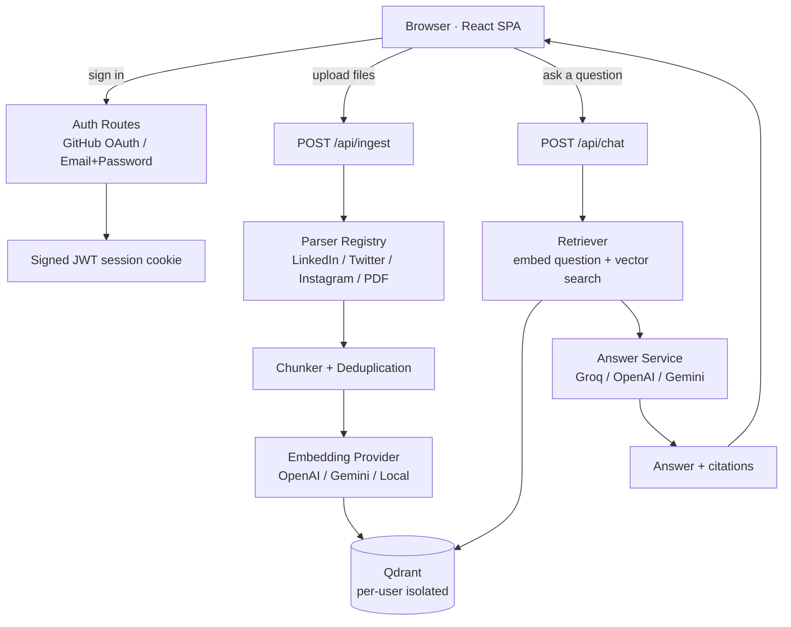

# Memex

Memex is a personal knowledge base that ingests your social media exports — LinkedIn, Twitter/X, Instagram, PDFs, images — and lets you have a conversation with them. Ask a question and get a grounded, cited answer pulled from your own words, scoped privately to your account.

## Tech Stack

- **Frontend** — React 19, Vite, Tailwind CSS v4, Lucide React
- **Backend** — Node.js, Express 4, ES Modules
- **Auth** — GitHub OAuth + email/password (bcryptjs, JWT session cookie via `jsonwebtoken` + `cookie-parser`)
- **Vector DB** — Qdrant Cloud (`@qdrant/js-client-rest`), per-user isolated collections
- **Embeddings** — OpenAI / Gemini (`@google/genai`) / local deterministic fallback (no API key needed)
- **LLM** — Groq / OpenAI / Gemini, with automatic priority fallback
- **Parsers** — `csv-parse` (LinkedIn), `cheerio` (Instagram HTML), `pdfjs-dist` (PDF), `tesseract.js` (image OCR, dev only)
- **Deployment** — Vercel (serverless functions + static client)

## Codebase Flow

## What Each Layer Does

- **Auth** — signs in via GitHub or email/password, issues a signed session cookie; every request downstream carries a `userId`.
- **Ingestion** — parses uploaded files by platform, splits them into chunks, skips ones already seen (content-hash dedup), embeds the rest, and stores them in Qdrant tagged with the owner's `userId`.
- **Retrieval** — embeds the incoming question and does a vector search filtered to the current user's own data — no cross-user leakage.
- **Answer Service** — feeds the retrieved chunks to an LLM with a "cite your sources" system prompt, returning an answer plus per-chunk citations.
- **Frontend** — a single chat view: ask questions, attach files via the composer's paperclip icon, see cited sources in the side panel.

## Live Snapshot

Live app: **[falppr-client.vercel.app](https://falppr-client.vercel.app)**

## V2 — Future Plans

- **Async import queue** — background worker with real-time progress via SSE/WebSocket instead of a blocking upload request
- **Hybrid search** — combine vector similarity with BM25 keyword scoring for better recall
- **Reranking layer** — cross-encoder rerank of top candidates before they reach the LLM
- **Streaming chat** — stream LLM tokens to the client instead of waiting for the full response
- **More parsers** — Medium, Substack, GitHub activity, YouTube comments
